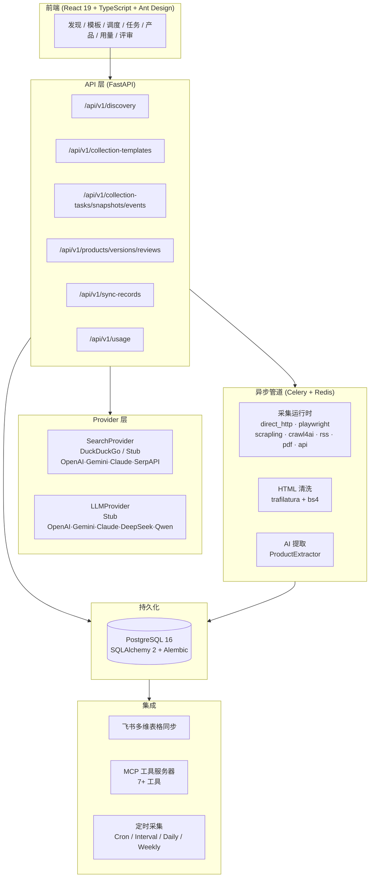

[🇨🇳 中文](README.md) · [🇺🇸 English](docs/README.en.md) · [🇯🇵 日本語](docs/README.ja.md) · [🇰🇷 한국어](docs/README.ko.md)

---

<p align="center">
  
</p>

<p align="center">
  
</p>

<p align="center">
  AI 驱动的竞品信息自动采集、结构化提取与分析系统。<br>
  将散落在互联网上的公开竞品信息，转化为结构化的产品数据库和可追溯的商业情报。
</p>

<p align="center">
  
  
  
  
  
  
  
  
</p>

---

## 解决什么问题

手动竞品情报采集效率低、不一致、难以规模化。CPIS 用结构化的 AI 辅助流程替代它。

| 传统方式 | CPIS |
|---------|------|
| 手动浏览网页 + 复制粘贴 | 自然语言 → 结构化数据 |
| 零散的笔记和表格 | 集中数据库 + 版本管理 |
| 一次性分析，不可重复 | 声明式 RunPlan + 模板 |
| 竞品变化难以追踪 | 产品差异对比 + Changelog + 置信度评分 |

---

## 产品工作流


---

## 核心功能模块

| 模块 | 说明 |
|------|------|
| **AI 来源发现** | SearchProvider + LLMProvider 架构，从自然语言描述自动发现相关竞品信息来源。默认 DuckDuckGo，预留 OpenAI/Gemini/Claude/SerpAPI 接口。 |
| **候选来源筛选** | 风险评估（低/中/高/拦截）、来源类型分类（官网/电商/资讯/评测）、综合排序。 |
| **RunPlan 引擎** | 声明式 JSON 计划，支持 URL 列表、URL 模式、搜索、Sitemap 四种来源类型。无动态代码执行，经 Pydantic 校验。 |
| **采集运行时** | 8 种注册器：direct HTTP（默认启用）、Playwright（功能开关控制）、5 种预留（Scrapling/Crawl4AI/RSS/PDF/API）。每种采集器独立重试策略、执行报告。 |
| **AI 结构化提取** | ProductExtractor + ModelProvider 管道，将清洗后的 HTML 转换为结构化的 Product、ProductVersion、ProductEvidence 记录。置信度阈值 0.7 自动通过。 |
| **产品版本管理** | 版本间差异对比、Changelog 生成、基于证据的提取（带来源归因）。 |
| **人工评审** | 审批工作流（自动通过/需人工/已批准/已拒绝），任务级多阶段状态追踪。 |
| **飞书多维表格同步** | 双向同步，重试+状态追踪，单条/批量同步 API。 |

---

## 系统架构



---

## 快速开始

**前提：** Docker、Docker Compose、Git。

```bash
# 1. 克隆并配置
git clone https://github.com/a672780966/Competitive-Product-Intelligence-System.git
cd Competitive-Product-Intelligence-System
cp .env.example .env

# 2. 启动全部服务
docker compose -f docker-compose.demo.yml up -d

# 3. 导入演示数据
docker compose -f docker-compose.demo.yml exec backend python /app/scripts/seed_demo.py
```

**打开** [http://localhost:8000/docs](http://localhost:8000/docs) 查看 API 文档，或 [http://localhost:8080](http://localhost:8080) 访问前端界面。

详细部署文档见 **[QUICK_START.md](release/QUICK_START.md)**，演示脚本见 **[DEMO_SCRIPT.md](release/DEMO_SCRIPT.md)**。

---

## 演示

演示数据脚本会创建 3 个示例产品、一个发现会话和一个采集模板：

```bash
docker compose -f docker-compose.demo.yml exec backend python /app/scripts/seed_demo.py
```

演示内容包括：
- **产品列表** — 3 个产品带版本历史
- **用量仪表盘** — 搜索、采集、提取的每日统计
- **采集模板** — 预配置的 RunPlan 模板
- **来源发现** — 示例发现会话及候选来源

---

## MCP 集成

CPIS 提供 MCP（Model Context Protocol）服务器，支持 AI 助手和 MCP 兼容工具程序化接入：

| 工具 | 说明 |
|------|------|
| `search_discovery` | 从自然语言查询发现来源 |
| `get_candidates` | 列出发现会话的候选来源 |
| `create_run_plan` | 创建并执行采集 RunPlan |
| `list_products` | 查询产品列表 |
| `get_task_status` | 检查任务管道状态 |
| `list_templates` | 列出采集模板 |
| `get_usage_summary` | 获取用量统计 |

启动 MCP 服务器：`python backend/mcp_server.py`

---

## OpenClaw 证据桥接

CPIS 通过 `cpis-json-gate` 插件与 OpenClaw Agent 框架集成，对证据 JSON 模式进行校验后接入管道。支持三种 Agent 角色（采集、分析、策展）—— 采集 Agent 证据路径已实现，分析和策展角色计划在后续版本中开发。

---

## 飞书多维表格同步

CPIS 与飞书多维表格深度集成：

- **双向同步** — 产品数据从 CPIS 推送到飞书，支持飞书端修改后同步回 CPIS
- **状态追踪** — 每次同步记录状态、时间戳、错误信息
- **重试机制** — 同步失败自动重试
- **单条/批量模式** — 支持同步单个产品或全部待同步版本

环境变量配置：`FEISHU_APP_ID`、`FEISHU_APP_SECRET`、`FEISHU_BITABLE_TOKEN`

---

## 技术栈

| 类别 | 技术 |
|------|------|
| **后端** | Python 3.12, FastAPI, SQLAlchemy 2, Alembic, Pydantic v2 |
| **数据库** | PostgreSQL 16, Redis 7 |
| **异步** | Celery 5 (Redis broker), asyncio |
| **采集** | httpx, Playwright, BeautifulSoup4, lxml, trafilatura |
| **前端** | React 19, TypeScript, Vite, Ant Design 5, TanStack Query |
| **基础设施** | Docker Compose, 多阶段 Dockerfile |
| **AI 层** | OpenAI 兼容 LLM API, DuckDuckGo Search |
| **集成** | 飞书开放 API, MCP 协议 |

---

## 路线图

- **发现 Provider** — OpenAI Search / Gemini Search / Claude Search / SerpAPI
- **LLM Provider** — OpenAI / Gemini / Claude / DeepSeek / Qwen 提取与分类
- **采集运行时扩展** — RSS 订阅 / PDF 文档 / REST API / Scrapling / Crawl4AI
- **企业工作流** — 审批角色 / 审计日志 / 定时情报简报
- **产品情报** — 高级差异对比 / 竞品时间线 / 品类比较视图
- **集成扩展** — 飞书自动化触发 / MCP 工具扩展 / 报告导出（PDF / Excel）

---

## 许可

MIT License。详见 [LICENSE](release/LICENSE.md)。
