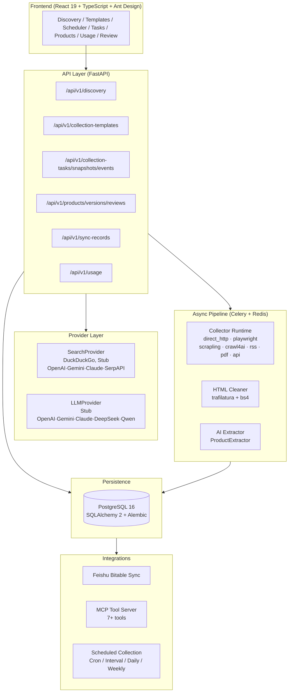

[🇨🇳 中文](../README.md) · [🇺🇸 English](README.en.md) · [🇯🇵 日本語](README.ja.md) · [🇰🇷 한국어](README.ko.md)

---

<p align="center">
  <b>CPIS V1</b><br>
  <b>AI-Powered Competitive Product Intelligence Platform</b>
</p>

<p align="center">
  Automatically collect, extract, and analyze competitive product information<br>
  from public web sources — transforming raw data into structured, actionable insights.
</p>

<p align="center">
  
  
  
  
  
  
  
  
</p>

---

## Why CPIS

Manual competitive intelligence is slow, inconsistent, and doesn't scale. CPIS replaces it with a structured, AI-assisted pipeline.

| Before | After |
|--------|-------|
| Manual browsing and copy-paste | Natural language → structured data |
| Scattered notes and spreadsheets | Centralized database with versioning |
| One-off analysis with no repeatability | Declarative RunPlans and templates |
| Hard-to-track competitive changes | Product diffs, changelogs, confidence scoring |

**Key capabilities:**

- **AI-Native Discovery** — SearchProvider + LLMProvider architecture discovers relevant sources from natural language queries, with risk assessment and source type classification
- **Declarative Collection** — JSON RunPlans define what, where, and how to collect, with URL pattern resolution and collector routing
- **Structured Extraction** — AI extraction pipeline converts unstructured HTML into normalized product data with confidence scoring and version tracking
- **Enterprise Integration** — Feishu Bitable sync, human review workflows, usage dashboards, and MCP tool server

---

## Product Workflow


---

## Core Modules

| Module | Description |
|--------|-------------|
| **AI Discovery** | SearchProvider + LLMProvider for intelligent source discovery from natural language. DuckDuckGo (default), Stub for testing, with reserved slots for OpenAI, Gemini, Claude, SerpAPI. |
| **Candidate Selection** | Risk assessment (low/medium/high/blocked), source type classification (official/marketplace/news/review), ranking by desirability score. |
| **RunPlan Engine** | Declarative JSON plans with URL list, pattern resolution, search, and sitemap source types. No dynamic code execution. Validated against Pydantic schema. |
| **Collector Runtime** | 8-registry system: direct HTTP (default, always enabled), Playwright (feature-gated), and 5 reserved runtimes (Scrapling, Crawl4AI, RSS, PDF, API). Retry policies per runtime. Execution reports for every fetch. |
| **AI Extraction** | ProductExtractor + ModelProvider pipeline converts cleaned HTML into structured Product, ProductVersion, and ProductEvidence records. Confidence threshold (0.7) for auto-approve. |
| **Product Versioning** | Diff tracking between product versions, changelog generation, evidence-based extraction with source attribution. |
| **Human Review** | Approval workflow with auto-approve, reject, and reopen. Multi-stage pipeline status tracking per task. |
| **Feishu Bitable Sync** | Bidirectional sync with retry logic, status tracking, and record ID persistence. Manual and batch sync endpoints. |

---

## Architecture



---

## Quick Start

**Prerequisites:** Docker, Docker Compose, Git.

```bash
# 1. Clone and configure
git clone https://github.com/a672780966/Competitive-Product-Intelligence-System.git
cd Competitive-Product-Intelligence-System
cp .env.example .env

# 2. Start all services
docker compose -f docker-compose.demo.yml up -d

# 3. Seed demo data
docker compose -f docker-compose.demo.yml exec backend python /app/scripts/seed_demo.py
```

**Open** [http://localhost:8000/docs](http://localhost:8000/docs) for API docs, or [http://localhost:8080](http://localhost:8080) for the frontend UI.

See **[QUICK_START.md](../release/QUICK_START.md)** for detailed setup and **[DEMO_SCRIPT.md](../release/DEMO_SCRIPT.md)** for a guided walkthrough.

---

## Demo

```bash
docker compose -f docker-compose.demo.yml exec backend python /app/scripts/seed_demo.py
```

After seeding, browse:
- **Products** — 3 products with version history
- **Usage Dashboard** — daily stats for searches, collections, and extractions
- **Collection Templates** — pre-configured RunPlan template
- **Discovery** — sample discovery session with candidates

---

## MCP Integration

CPIS exposes an MCP server, enabling AI assistants and MCP-compatible tools to interact programmatically:

| Tool | Description |
|------|-------------|
| `search_discovery` | Discover sources from natural language query |
| `get_candidates` | List candidates for a discovery session |
| `create_run_plan` | Create and execute a collection RunPlan |
| `list_products` | List products with filters |
| `get_task_status` | Check task pipeline status |
| `list_templates` | List collection templates |
| `get_usage_summary` | Get usage statistics |

Start MCP server: `python backend/mcp_server.py`

---

## OpenClaw Evidence Bridge

CPIS integrates with the OpenClaw agent framework via the `cpis-json-gate` plugin, which validates evidence JSON schemas before accepting data into the pipeline. Three agent roles are planned (Collector, Analyst, Curator) — the Collector agent evidence path is implemented; Analyst and Curator are planned for future releases.

---

## Feishu Bitable Sync

- **Bidirectional sync** — Product data flows from CPIS to Bitable and back
- **Status tracking** — Every sync has a record with status, timestamps, and error messages
- **Retry logic** — Failed syncs are retried with backoff
- **Manual and batch modes** — Sync individual products or all pending versions

Configure via: `FEISHU_APP_ID`, `FEISHU_APP_SECRET`, `FEISHU_BITABLE_TOKEN`.

---

## Tech Stack

| Category | Technologies |
|----------|-------------|
| **Backend** | Python 3.12, FastAPI, SQLAlchemy 2, Alembic, Pydantic v2 |
| **Database** | PostgreSQL 16, Redis 7 |
| **Async** | Celery 5 (Redis broker), asyncio |
| **Collection** | httpx, Playwright, BeautifulSoup4, lxml, trafilatura |
| **Frontend** | React 19, TypeScript, Vite, Ant Design 5, TanStack Query |
| **Infrastructure** | Docker Compose, multi-stage Dockerfiles |
| **AI Layer** | OpenAI-compatible LLM API, DuckDuckGo Search |
| **Integrations** | Feishu Open API, MCP Protocol |

---

## Roadmap

- **Discovery Providers** — OpenAI Search, Gemini Search, Claude Search, SerpAPI
- **LLM Providers** — OpenAI, Gemini, Claude, DeepSeek, Qwen extraction/classification
- **Collector Runtime Expansion** — RSS feeds, PDF documents, REST API collectors, Scrapling, Crawl4AI
- **Enterprise Workflow** — Approval roles, audit trails, scheduled intelligence briefs
- **Product Intelligence** — Advanced diffing, competitor timelines, category-level comparison views
- **Integrations** — Feishu automation triggers, MCP tool expansion, report export (PDF, Excel)

---

## License

MIT License. See [LICENSE](../release/LICENSE.md) for details.
