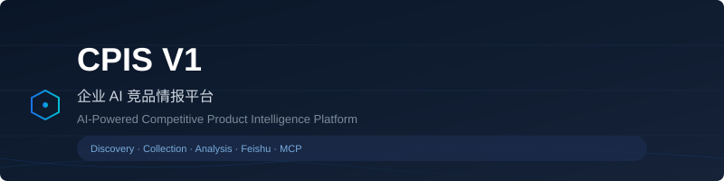
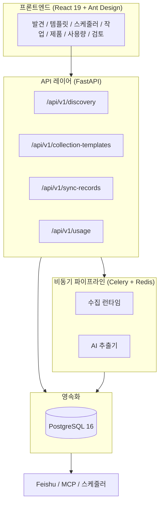

[🇨🇳 中文](../README.md) · [🇺🇸 English](README.en.md) · [🇯🇵 日本語](README.ja.md) · [🇰🇷 한국어](README.ko.md)

---

<p align="center">
  
</p>

<p align="center">
  
</p>

<p align="center">
  
  
  
  
  
  
  
  
</p>

---

## CPIS 소개

CPIS(Competitive Product Intelligence System)는 공개 웹 소스에서 경쟁사 제품 정보를 자동으로 수집, 추출, 분석하는 엔터프라이즈 플랫폼입니다. AI 지원 파이프라인을 통해 분산된 경쟁 정보를 구조화된 데이터베이스와 추적 가능한 비즈니스 인텔리전스로 변환합니다.

---

## 제품 워크플로우


---

## 핵심 모듈

| 모듈 | 설명 |
|------|------|
| **AI 소스 발견** | SearchProvider + LLMProvider 기반 자연어 소스 발견 |
| **후보 소스 선정** | 위험 평가, 소스 유형 분류, 점수 산정 |
| **RunPlan 엔진** | 선언적 JSON 계획, URL 패턴 해결 |
| **수집 런타임** | 8개 등록 런타임 (HTTP/Playwright/예약) |
| **AI 추출** | HTML → 구조화된 Product + ProductVersion |
| **제품 버전 관리** | 차이 추적, Changelog, 증거 기반 추출 |
| **검토 워크플로우** | 승인/거부/재개, 자동 승인 임계값 |
| **Feishu 동기화** | 양방향 Bitable 동기화, 재시도, 상태 추적 |

---

## 시스템 아키텍처



---

## 빠른 시작

```bash
git clone https://github.com/a672780966/Competitive-Product-Intelligence-System.git
cd Competitive-Product-Intelligence-System
cp .env.example .env
docker compose -f docker-compose.demo.yml up -d
docker compose -f docker-compose.demo.yml exec backend python /app/scripts/seed_demo.py
```

[http://localhost:8000/docs](http://localhost:8000/docs) · [http://localhost:8080](http://localhost:8080)

---

## 라이선스

MIT License. 자세한 내용은 [LICENSE](../release/LICENSE.md)를 참조하세요.

---

> 이 문서는 기계 번역을 포함합니다. 정확한 내용은 중국어 README를 기준으로 합니다.
